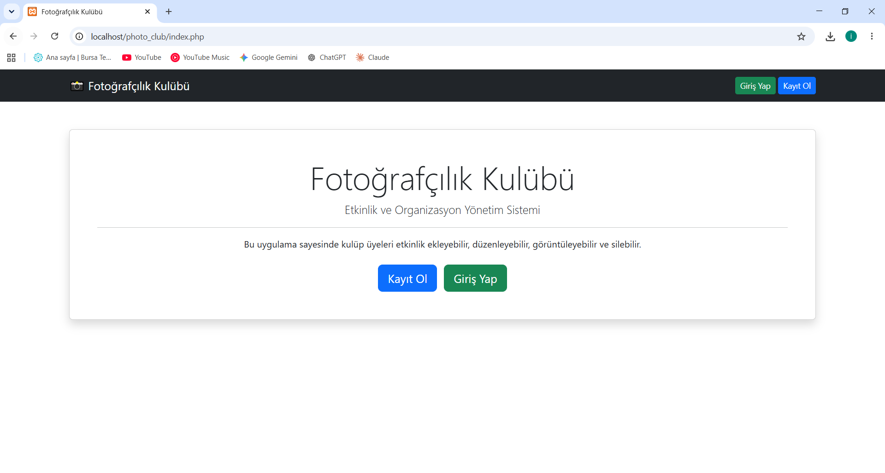
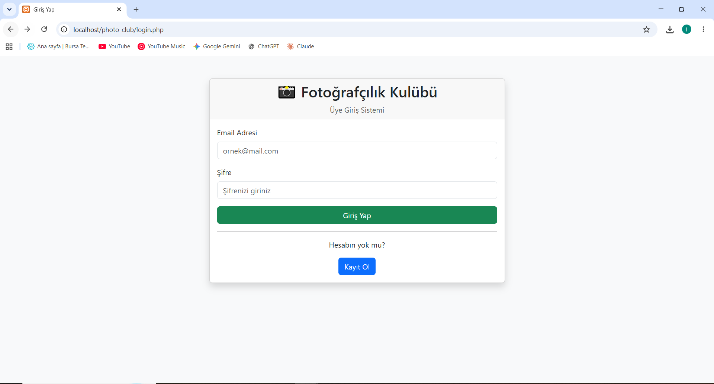
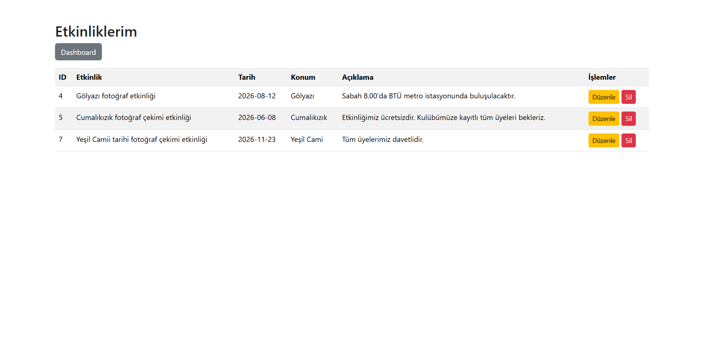

# Fotoğrafçılık Kulübü Etkinlik Yönetim Sistemi

## Proje Hakkında

Bu proje, Web Tabanlı Programlama dersi kapsamında geliştirilmiş bir web uygulamasıdır.

Uygulamanın amacı, fotoğrafçılık kulübü üyelerinin etkinliklerini kolayca yönetebilmesini sağlamaktır. Kullanıcılar sisteme kayıt olabilir, giriş yapabilir ve kendilerine ait etkinlikleri ekleyebilir, görüntüleyebilir, güncelleyebilir ve silebilirler.

Uygulama PHP ve MySQL kullanılarak geliştirilmiştir. Arayüz tasarımında Bootstrap CSS kütüphanesinden yararlanılmıştır.

---

## Kullanılan Teknolojiler

- PHP
- MySQL
- HTML5
- Bootstrap 5
- XAMPP
- phpMyAdmin

---

## Proje Özellikleri

### Kullanıcı Yönetimi

- Yeni kullanıcı kaydı oluşturma
- Güvenli giriş sistemi
- Şifrelerin hashlenerek saklanması
- Oturum açma ve kapama işlemleri
- Session tabanlı kullanıcı kontrolü

### Etkinlik Yönetimi

- Yeni etkinlik ekleme
- Eklenen etkinlikleri görüntüleme
- Etkinlik bilgilerini güncelleme
- Etkinlik silme

---

## Veritabanı Yapısı

### users Tablosu

| Alan | Tip |
|--------|--------|
| id | INT |
| username | VARCHAR(50) |
| email | VARCHAR(100) |
| password | VARCHAR(255) |

### events Tablosu

| Alan | Tip |
|--------|--------|
| id | INT |
| user_id | INT |
| title | VARCHAR(100) |
| event_date | DATE |
| location | VARCHAR(100) |
| description | TEXT |

---

## Kurulum Adımları

1. XAMPP kurulmalıdır.
2. Apache ve MySQL servisleri başlatılmalıdır.
3. phpMyAdmin üzerinden photo_club_db isimli veritabanı oluşturulmalıdır.
4. users ve events tabloları oluşturulmalıdır.
5. Proje dosyaları htdocs klasörüne kopyalanmalıdır.
6. Tarayıcı üzerinden uygulama çalıştırılabilir.

---

## Proje Dosya Yapısı

```text
photo_club
│
├── config.php
├── index.php
├── register.php
├── login.php
├── logout.php
├── dashboard.php
├── add_event.php
├── list_events.php
├── edit_event.php
├── delete_event.php
├── screenshots
│   ├── ana_sayfa.png
│   ├── login.png
│   └── etkinlikler.png
├── README.md
└── AI.md
```

---

## Ekran Görüntüleri

### Ana Sayfa



### Giriş Sayfası



### Etkinlik Listesi



---

## Demo Video

Video bağlantısı:

https://drive.google.com/file/d/1t_1NwIoE-4FAnSETxjehln5kkr-VFg-P/view?usp=drive_link

---

## Güvenlik Önlemleri

- Kullanıcı şifreleri password_hash() fonksiyonu ile hashlenerek saklanmaktadır.
- Giriş işlemlerinde password_verify() kullanılmaktadır.
- Kullanıcı oturumları PHP Session mekanizması ile yönetilmektedir.
- Giriş yapılmadan korumalı sayfalara erişim engellenmektedir.
- Kullanıcılar yalnızca kendi etkinliklerini düzenleyebilir ve silebilir.

---

## Geliştirici

İrem Rana Peker

Web Tabanlı Programlama Dersi Projesi
2026